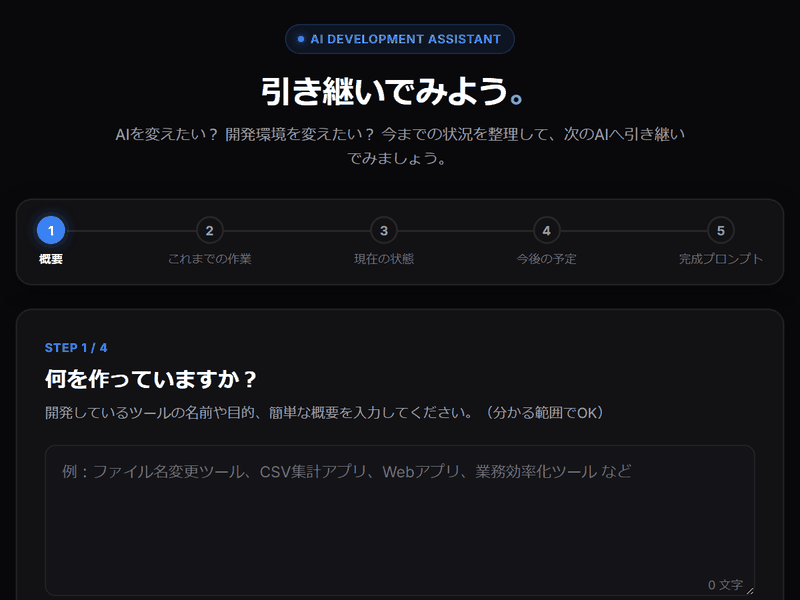

引き継いでみよう。

## AI開発 引き継ぎアシスタント

> AIを変えたい？
>
> 開発環境を変えたい？
>
> だったら、プロジェクトを引き継いでみよう。

AIを使って開発していると、

- 別のAIを使ってみたい
- AI開発環境を変えたい
- 新しいチャットで開発を続けたい
- 途中まで作ったプロジェクトを別のAIに説明したい
- 「今まで何をやったのか」を説明するのが面倒

ということがあります。

このツールは、現在のプロジェクトを次のAIへ説明するための引き継ぎ文書を作る小さなWebツールです。

---

## コンセプト

# 引き継いでみよう。

AI開発では、一つのAIだけを使い続ける必要はありません。

ChatGPTを使っていたけれどGeminiに変える。

GeminiからClaudeに変える。

AI開発環境を変える。

新しいチャットを始める。

そんなことも普通にあります。

そのときに必要なのが、

> **「今まで何をやったのか」**

を次のAIに伝えることです。

---

## 使い方

### 1. プロジェクトについて入力する

分かる範囲で入力します。

例えば、

> 「ファイル名変更ツールを作っている」

> 「画面は完成していて、データ保存を追加中」

> 「エラーを修正したところ」

などです。

---

### 2. 今までやったことを入力する

例えば、

- 作った機能
- 修正したこと
- 現在の状態
- 残っている問題
- 次にやりたいこと

などを入力します。

全部覚えていなくても構いません。

---

### 3. AIに引き継ぎ文書を作ってもらう

入力した内容をもとに、次のAIへ渡すための文書を作ります。

例えば、

- プロジェクトの目的
- 現在の状態
- 完了したこと
- 未完了のこと
- 問題点
- 注意事項
- 次にやること

などを整理します。

---

### 4. 新しいAIへ渡す

作成された引き継ぎ文書をコピーして、次に使うAIへ渡します。

これだけです。

---

## 完璧な引き継ぎ文書は必要ありません

このツールでは、利用者が完璧な開発履歴を作る必要はありません。

分かることだけ入力してください。

足りない情報があれば、AIに整理してもらいます。

---

## AIを変えてもいい

このツールは、

> 「一つのAIを使い続けなければならない」

という考え方をしません。

自分に合ったAIや開発環境を使えばいい。

必要になったら、

**引き継いで、また作る。**

それだけです。

---

## このツールがしないこと

このツールは、プロジェクト全体を自動解析するものではありません。

GitHubやPCのファイルを自動的に読み込むこともしません。

高度なコンテキスト管理システムでもありません。

目的はもっと単純です。

> **「次のAIに、このプロジェクトを説明するための文書を作る」**

ことです。

---

## 対象

- AIを変えたい人
- AI開発環境を変えたい人
- 新しいチャットで開発を続けたい人
- AI開発初心者
- 開発途中のプロジェクトを引き継ぎたい人

---

## 公開

GitHub Pagesで利用できる無料Webツールとして公開します。

インストールは必要ありません。